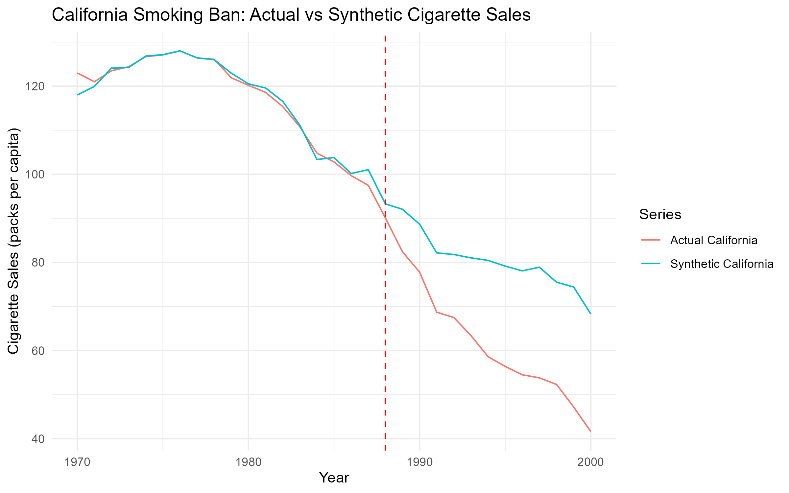
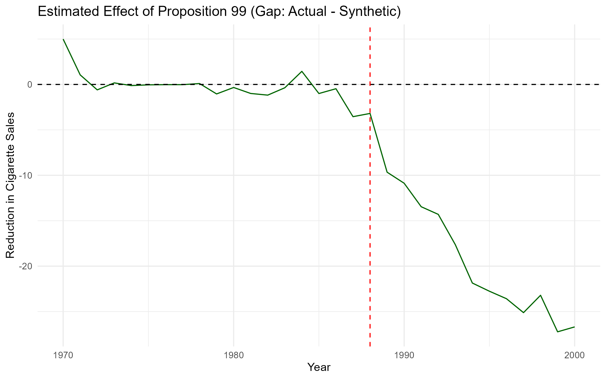
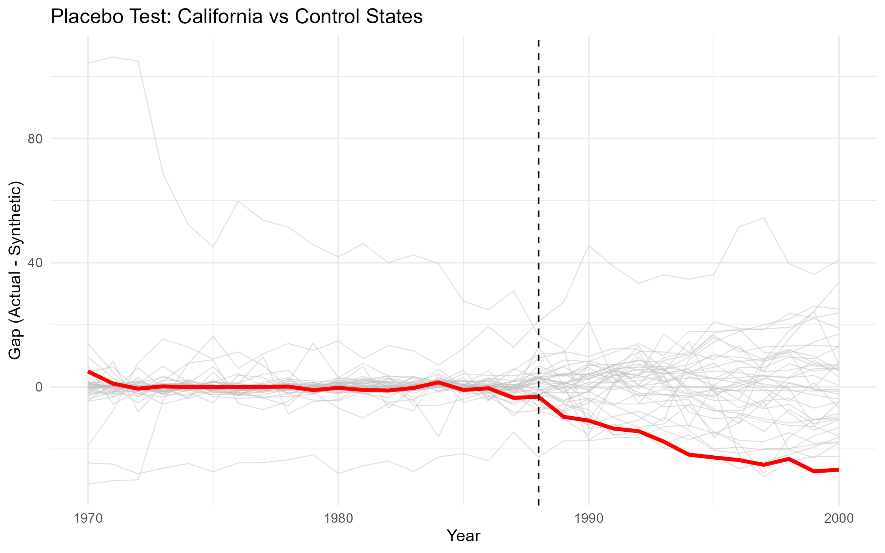

# Synthetic Control – California Smoking Ban

Estimates the causal effect of California's Proposition 99 (1988 tobacco tax and control program) on cigarette sales using **Synthetic Control Method** implemented in R.

## Methods
- Quadratic programming with non‑negativity constraints and sum‑to‑one weights
- Ridge stabilisation for near‑singular matrices
- Permutation‑based inference (in‑space placebo tests)

## Key Results
- **Estimated reduction** : ~19.7 packs per capita per year
- **p‑value (two‑sided)** : 0.0263
- **Interpretation** : Statistically significant effect (p < 0.05)

## Visualisations
### Actual vs Synthetic California

### Treatment Effect (Gap)

### Placebo Test (all control states in grey, California in red)

## Repository Structure
- `01_simulate_and_optimize.R` – validation on simulated data
- `02_real_data_placebo.R` – full real‑data analysis
- `*.png` – plots generated from the analysis

## How to Run
1. Open `02_real_data_placebo.R` in RStudio.
2. Run line by line.
3. Plots will be saved automatically.

## References
Abadie, Diamond, Hainmueller (2010). "Synthetic Control Methods for Comparative Case Studies".
